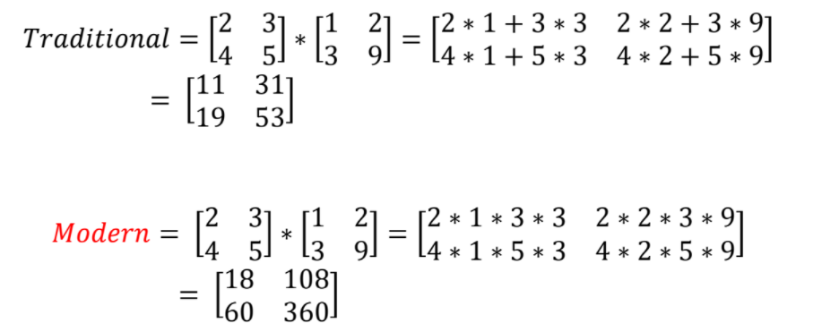
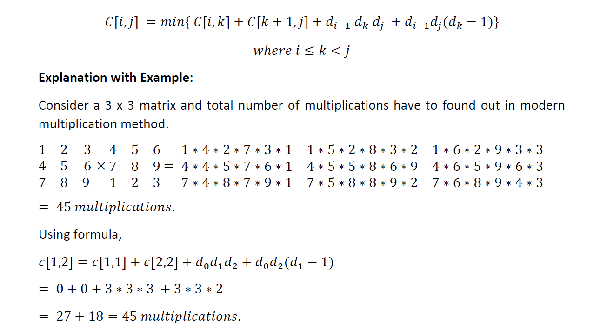

# Matrix Chain Multiplication Modification

A modern matrix chain multiplication is defined where all the addition operations are replaced by multiplication operations.

The minimum number of scalar multiplications and the optimal sequence of multiplication needs to be calculated.

The new recursive equation and the subsequent calculations can be formulated as follows:

## Steps for execution
- Run matrix-multiplication.c in Codeblocks or command prompt.
- Input the number of matrices
- Input the dimensions of the matrices
- The cost matrix, minimum number of multiplications and the optimal sequence of multiplication is displayed as output.

## Approach
- The number of extra multiplications incurred is calculated when addition operations are replaced by multiplication operations.
- The recursive equation is formulated as:
> cost=m[i][k]+m[k+1][j]+d[i-1]*d[k]*d[j]+d[i-1]*d[j]*(d[k]-1)
>
> where i<=k<j, d[i] is the array containing dimensions, m[i][j] stores the number of scalar multiplications.

- the minimum among the cost id identified for the minimum number of multiplications.
- The index that give minimum multiplication is stored in another 2-d array which is used to find the optimal sequence of multiplication.

## Time Complexity
> Worst case: $O(n^3)$
## Space Complexity
> Worst Case: $O(n^2)$